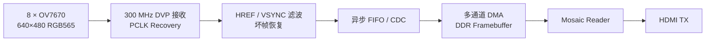

# sixteen_camera

基于 Xilinx Virtex UltraScale+ VU13P 的多路 OV7670 视频采集与 HDMI 输出工程。

当前版本实现 **8 路 OV7670 DVP 输入**。摄像头输出的 VGA RGB565 视频经过
300 MHz 数字 PCLK 恢复、跨时钟域传输和 DDR 帧缓存，最终以 mosaic 方式输出到
HDMI。仓库名称保留了后续扩展到 16 路摄像头的目标。

## 数据通路



主要特性：

- 8 路 OV7670 独立 SCCB/IIC 初始化，写入 NACK 自动重试并报告明确失败状态；
- 300 MHz 对 PCLK、DATA、HREF 和 VSYNC 进行 IOB 首拍采样；
- PCLK 周期/相位恢复，将摄像头 PCLK 转换为单一 300 MHz 域内的 `pixel_ce`；
- PCLK 毛刺拒绝、单边沿丢失恢复、lock/loss/missing/glitch 诊断；
- HREF 8 周期滤波、VSYNC 256 周期滤波及最小帧间隔门控；
- 行边界 CDC、坏帧补齐、下一帧 SOF 重新同步；
- 多通道 AXI DMA 写入 DDR，HDMI mosaic reader 并行显示；
- 裸机软件提供 HDMI、摄像头初始化和简洁串口诊断。

## 目录

| 路径 | 内容 |
| --- | --- |
| `rtl/video/camera/` | OV7670 前端、PCLK 恢复与摄像头 CDC |
| `rtl/video/framebuffer/` | 多通道 DMA、帧管理和 mosaic reader |
| `rtl/ip/` | HDMI、VPHY、AXI 等 Vivado IP 源文件 |
| `rtl/soc/` | Rocket/Chipyard 控制 SoC 生成 RTL |
| `xdc/` | VU13P、FMC、摄像头、DDR 和 HDMI 约束 |
| `sim/` | PCLK、IIC、CDC、帧管理和 reader 测试平台 |
| `sw/` | 裸机控制软件、OpenOCD/GDB 下载脚本 |
| `prj/` | Vivado 工程、BD 源和构建 Tcl |
| `doc/` | 接收恢复设计、修复规范和硬件方案记录 |

## 环境

- Vivado 2023.2
- iverilog（摄像头接收单元仿真）
- RISC-V GCC/GDB 工具链
- OpenOCD，使用 FPGA BSCAN 连接 Rocket Debug Module
- 串口：115200 8N1

工程中的脚本默认使用本机 `/mnt/data/Vivado/Vivado/2023.2` 和 Chipyard 工具链
路径；在其他环境中使用时需要调整对应路径或通过软件脚本的环境变量覆盖。

## 生成比特流

```bash
cd prj
/mnt/data/Vivado/Vivado/2023.2/bin/vivado \
  -mode batch -source build_bitstream.tcl
```

输出文件：

```text
prj/sixteen_camera.runs/impl_1/top_wrapper.bit
```

Vivado 的 runs、cache、DCP 和 bitstream 均属于生成文件，不提交到 Git。

> 当前版本可以完成综合、布局布线和 Bitgen，但最新实现报告仍存在负 setup
> 裕量。进行正式交付前应继续处理跨时钟/跨 SLR 路径，并重新完成时序签核。

## 软件编译与运行

编译裸机程序：

```bash
make -C sw
```

只检查工具和固件路径：

```bash
cd sw
./run.sh --check
```

下载并启动软件：

```bash
cd sw
./run.sh
```

执行软件前必须先将本工程 bitstream 下载到 FPGA，并释放 Vivado Hardware
Manager 对 JTAG 的占用。`run.sh` 支持通过 `OPENOCD_BIN`、`OPENOCD_CFG`、
`GDB_BIN`、`GDB_PYTHONHOME` 和 `ELF_FILE` 覆盖默认路径。

## 串口诊断

启动后在串口输入 `s` 获取状态。每个摄像头的主要输出格式为：

```text
CAM CHn init=OK frames=... size=1280x480
  line(ok/short/last)=... vs(ok/short)=...
  pclk(c/v/g/m/l)=... lock/state=... period=...
```

其中：

- `c/v/g/m/l`：candidate / valid / glitch / missing / lock-loss；
- `line short`、`mal` 持续增加通常表示输入行宽或 PCLK 接收仍不稳定；
- 未连接摄像头时出现 IIC 初始化失败属于预期现象；
- 连续两次输入 `s` 可获得区间增量，建议采样间隔约 5 秒且不超过 12 秒。

其他命令：

- `r`：重新初始化视频链路；
- `c`：读取板载时钟芯片 ID。

## 仿真示例

PCLK 恢复回归：

```bash
iverilog -g2012 -s tb_dvp_pclk_recovery \
  -o /tmp/tb_dvp_pclk_recovery.vvp \
  rtl/video/camera/dvp_pclk_recovery.sv \
  sim/tb_dvp_pclk_recovery.sv
vvp /tmp/tb_dvp_pclk_recovery.vvp
```

通过时输出：

```text
TB_DVP_PCLK_RECOVERY=PASS
```

## 当前状态

已完成并验证的重点包括：

- 8 路摄像头独立、顺序 IIC 初始化；
- 300 MHz PCLK 恢复和 DATA tap 2 采样；
- HREF/VSYNC 毛刺过滤；
- 行边界 CDC 和坏帧恢复；
- 8 路 DDR 写入与 HDMI mosaic 显示；
- PCLK Q16.8 相位累加器回绕和精确 1280-byte 行仿真。

硬件信号质量仍会受摄像头模块、杜邦线、FMC 转接板和 PCLK 串扰影响。建议判断
稳定性时优先观察 5 秒 DELTA 中的 `mal`、`missing`、`lock-loss` 和 `line_flush`，
不要只依据上电以来的累计计数。
