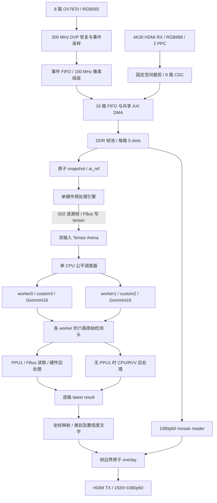
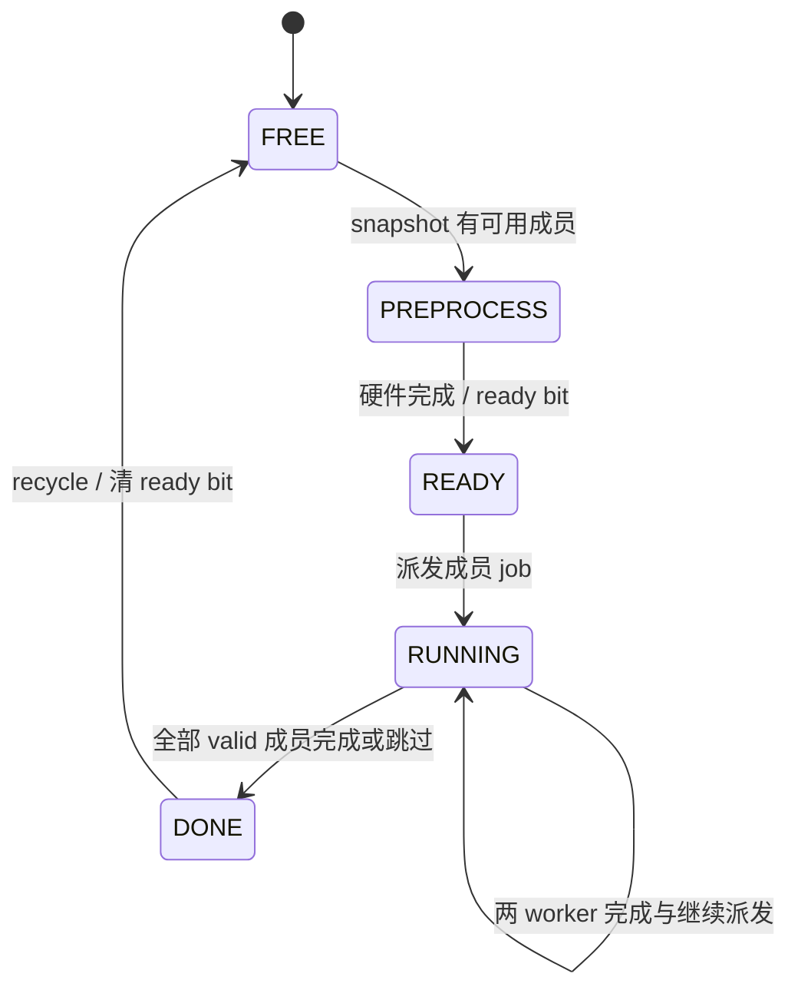

# YOLOv5nu 推理与 16 路视频系统架构

版本：2026-09-12，基于本次阅读时的工作区源码。目标器件：`xcvu13p-fhga2104-2-i`；工具工程：Vivado 2023.2；默认固件：`sw/Makefile` 的 `AI_MODEL=yolov5nu`。

本文以当前生产构建、顶层实例及函数实现为依据，覆盖视频输入、缓存、AI 输入、推理、后处理、显示、控制和验证工具。历史文档中的 TinyYOLOv2 默认配置、全链路 300 MHz、三缓冲、640×480 尚无 backend 等描述不再代表当前源码。**源码具备功能、仿真通过、历史上板记录、当前 bitstream 已验收是四种不同状态。** 本文没有重新下载 FPGA，也不据文件存在推断当前板上运行版本。

## 1. 阅读导航与核心结论

系统已实现一条端到端链路：8 路 OV7670 加 4K HDMI 解包得到的 8 路视频，统一写入 DDR；CPU 获取稳定帧引用，硬件转为 INT8 输入；两个 Gemmini16 worker 独立推理；CPU 或 PPU1 完成后处理；结果按视频通道保存，再映射到 1080p60 mosaic 的检测框和英文类别标签。

理解项目时要区分三种“批次/并行”：

| 概念 | 当前含义 |
| --- | --- |
| 16 路输入 | 16 个独立 stream，允许部分通道无有效帧 |
| Batch16 / 双 Tensor Arena | 每个 arena 留 16 个成员；单预处理引擎顺序处理，两个 arena 交替占用 |
| 双 Gemmini / batch=2 | 单 CPU 调度两个独立 Batch=1 图像任务；不是同一张图在两个阵列分片，也不是模型 batch 维度变为 2 |

当前 SoC 为 **1 Rocket RV64 + 1 Saturn RVV + 2 个逻辑 16×16 Gemmini**。不是历史方案中的三个 64×64 Gemmini。RVV 是 CPU 的向量执行资源，两个 worker 共享 CPU/RVV 的软件执行时间，拥有各自的 Gemmini 和激活内存。

本文第 2～5 节说明输入和内存；第 6～10 节是 YOLOv5nu 主体；第 11～15 节说明显示、接口和诊断；第 16～18 节说明验证、限制和代码定位；附录逐项列出 167 个调度 stage。

## 2. 全系统数据流与模块分工



| 顶层模块 | 已实现职责 |
| --- | --- |
| `rtl/top_wrapper.sv` | 摄像头引脚 IBUF/IOBUF、SoC、视频控制、DDR 三大子系统连接及接口实例 |
| `rtl/control/control_soc_subsystem.sv` | Si5338 初始化、100 MHz SoC 时钟、DDR ready 后释放 CPU、SoC memory/MMIO/FBus/UART/JTAG 边界 |
| `rtl/video/video_control_subsystem.sv` | MMIO、GPIO/IIC、摄像头与 HDMI 控制和视频流接口 |
| `rtl/memory/ddr_memory_subsystem.sv` | MIG/BD、视频时钟分频、视频 AXI CDC、DDR 帧流水线、FBus 写桥和后处理读通道 |
| `rtl/video/framebuffer/multi_channel_ddr_video_pipeline.sv` | 帧管理、DMA、snapshot、预处理、显示 reader、overlay 配置 CDC 的集成 |

SoC collateral 当前选自 `rtl/soc/tsmcchip.fpga.taihangsoc.TaihangSoCFPGATestHarness.TaihangSoC1Rocket1RVV2Gemmini16x16PackedFullOps256BitConfig/gen-collateral/`。`setup_vivado.tcl` 使用同名配置并排除旧 SoC 文件。另一个 SmallRocket 目录是保留版本，不是当前顶层实例依据。

### 2.1 时钟与复位

| 时钟域 | 频率/来源 | 工作内容 |
| --- | --- | --- |
| 板级配置 | 25 MHz | 两片 Si5338 的初始化控制 |
| SoC/控制/FBus | 板载差分 100 MHz，经 BUFG | Rocket、Gemmini、RVV 所在 SoC、MMIO、PPU/diagnostic |
| 摄像头控制 | clock wizard 输出 24 MHz | OV7670 SCCB、启动时序；各前端分频得到 12 MHz XCLK |
| capture / MIG UI | 约 300.120 MHz | PCLK/DATA/HREF/VSYNC 首拍采样、恢复事件、DDR UI |
| camera video | MIG UI 经 `BUFGCE_DIV=2`，约 150.060 MHz | RGB565 组装、视频归一化、帧管理、DMA、预处理、display reader |
| HDMI RX/TX | VPHY/IP 各自视频与串行域 | RX 2-PPC transport、TX 视频定时与串化 |

DDR calibration 和外部 reset 共同影响运行许可；DDR/video 域使用异步置位、同步释放的本地 reset 链。SoC 在 DDR calibration 同步后释放。300→150 MHz 采用专用全局时钟分频器，并非 fabric 逻辑生成时钟。跨域流使用 FIFO；命令及保持型配置用 toggle/ack；统计跨域读数用于诊断，不等于多通道同时曝光的时间戳。

## 3. 已实现的视频输入

### 3.1 八路本地 OV7670

源码主链是 `camera_subsystem → ov7670_frontend → dvp_event_bridge → camera_pixel_assembler → camera_axis_cdc → camera_axis_to_stream`。内部 stream 编号为 0～7，软件显示 CH1～CH8；后八路内部 8～15 显示 CH9～CH16。

前端实现以下功能：

- 八路独立 SCCB/IIC 写控制器，由初始化调度器顺序启动；配置表、PWDN/reset/XCLK 时序由硬件负责；写 NACK 可重试，当前 `MAX_RETRIES=3`，失败状态可读。
- 300 MHz 对 PCLK、DATA、HREF、VSYNC 首拍采样；PCLK 使用搜索、捕获、锁定、恢复状态和 Q16.8 周期/相位估计生成 `pixel_ce`，而非把外部 PCLK 当作主流水线时钟。
- PCLK 高低确认、过近边沿拒绝、周期 IIR、有限丢边沿 holdover、锁丢失/毛刺/缺失统计；默认 DATA sample offset 为 2。
- 当前 `camera_subsystem` 实例的 HREF filter 为 **16** 周期，VSYNC filter 为 **256** 周期；还有最小帧行数/间隔检查。旧 README 的 HREF=8 不用于本基线。
- `dvp_href_line_guard` 以每行 1280 bytes 为边界，处理短 HREF 间断、行尾确认和 flush；它无法保证从任意损坏信号恢复全部正确像素。
- `dvp_event_bridge` 把数据字节、行首/尾、帧边界、fault 合并为有序 14-bit 事件，FIFO 深度 1024；另有 fault toggle/ack，保证 FIFO 满时仍可通知错误。溢出后丢弃到新的帧边界。
- `camera_pixel_assembler` 在 150 MHz 组装 RGB565，扩展色深，清除半像素并在故障后等待帧边界；后级 CDC/归一化处理 SOF/EOL/EOF、残帧补齐与重新同步。

像素字节排列要按接口合同理解：摄像头像素组装的 24-bit 输出使用 `{R,B,G}` 位段布局以适配视频 IP；`channel_write_fifo` 只补高8位零，DDR像素字实际为 `{0,R,B,G}`，小端字节为 `G,B,R,0`。项目文档惯称其为XRGB8888，但并非通常意义的 `0x00RRGGBB`。预处理按 R=`[23:16]`、G=`[7:0]`、B=`[15:8]` 取色，再写紧凑RGB。不能凭信号名直接解释内存字节顺序。

### 3.2 一路 HDMI transport 解出八路 VGA

HDMI RX 合同是 3840×2160p30、progressive、RGB、8 bpc、48-bit AXI4-Stream、2 pixels/clock。软件模式检查全部满足后才使能捕获；断连或模式不匹配时关闭 HDMI 成员写入。

`hdmi_4k_spatial_demux` 在 4×2 个 960×1080 槽位中裁剪居中的 640×480 图像。每槽外围黑边不写 DDR。

| 内部 stream / 串口通道 | X 闭区间 | Y 闭区间 |
| --- | --- | --- |
| 8 / CH9 | 160～799 | 300～779 |
| 9 / CH10 | 1120～1759 | 300～779 |
| 10 / CH11 | 2080～2719 | 300～779 |
| 11 / CH12 | 3040～3679 | 300～779 |
| 12 / CH13 | 160～799 | 1380～1859 |
| 13 / CH14 | 1120～1759 | 1380～1859 |
| 14 / CH15 | 2080～2719 | 1380～1859 |
| 15 / CH16 | 3040～3679 | 1380～1859 |

支持 transport frame/malformed 以及八路 frame/overflow 统计。HDMI 子流经 `video_stream_cdc` 到 video 域后，与本地摄像头合并。硬件支持 16 路不表示现场必须接满；有效性最终以 snapshot `valid_mask` 判断。

## 4. DDR、帧缓存与所有权

### 4.1 数据端口

| 路径 | 使用端口 | 访问属性 |
| --- | --- | --- |
| Rocket/Gemmini 系统内存 | SoC memory → BD S00 | 由 SoC 系统内存路径进入 DDR |
| 16 路采集写帧 | video writer → write CDC → S01 AW/W/B | 物理地址、256-bit 数据、共享 DMA |
| 显示读帧 | video reader → read CDC → S01 AR/R | 与写帧共用 S01 的独立读写通道 |
| 预处理读源图 | preprocess reader → read CDC → S02 AR/R | 直接读取物理 framebuffer |
| 预处理写 tensor | `axi4_write_cdc` → FBus AW/W/B | 加 bit31 DDR alias，进入 SoC 一致性入口 |
| PPU/diagnostic 读检测头 | FBus AR/R | 与预处理写端通过 `axi4_channel_join` 合并 |

S02 写请求被终止为空闲；不能为了布线方便把 tensor 写端改回 S02。FBus 外部接口为 **33-bit address / 256-bit data / 4-bit ID**，但内部平台通路为 **64-bit @100 MHz**；外部 256-bit 不代表 3.2 GB/s 持续带宽。

视频 DMA 有逐路 FIFO、共享仲裁、burst descriptor、多个 outstanding 和 B response 完成核对。流水线默认 burst 最大 64 beats，write outstanding=8、write descriptor depth=16，read outstanding=8、read descriptor depth=8。帧“写完”以写响应完成为依据，不以最后一个输入像素或 W beat 已发出为依据。

### 4.2 五 slot 帧池

每幅源图 640×480，XRGB8888，每行 2560 bytes，每帧有效数据 **1,228,800 bytes**。每个 slot 地址步长 **4 MiB**，每路 **5 slots**，通道池基址相隔 **32 MiB**：

```text
pool(stream) = 0x08000000 + stream × 0x02000000
slot(stream, k) = pool(stream) + k × 0x00400000，k=0..4
pixel(x,y) = slot + y × 2560 + x × 4
```

末路池基址为 `0x26000000`。slot 步长和通道保留窗并不等于实际像素 payload。

`multi_channel_frame_manager` 管理 FREE、WRITING、READY、READING（显示读取）状态及独立 `ai_ref`。writer 只能拿可写 slot；完整帧更新 latest-ready 与元数据；旧 READY 在无引用时回收。显示读取保持当前帧集合，AI snapshot 另外保持其所选 slot。读完显示不应释放仍被 AI 引用的帧；AI release 也不能回收仍在显示的帧。

无空闲 slot、输入 malformed、AXI 错误等有丢帧/错误统计。系统是有界缓冲和最新帧服务策略，不保存输入历史视频。

### 4.3 地址规划

| 对象 | 设备物理地址 | CPU 地址/说明 |
| --- | --- | --- |
| ELF、权重、静态激活 | 从 `0x00000000` 开始 | 从 `0x80000000` 链接 |
| 视频 pools | `0x08000000`～末路保留窗 | CPU 访问时 OR `0x80000000` |
| 输入 Tensor Arena 0 | `0x30000000` | `0xB0000000` |
| 输入 Tensor Arena 1 | `0x31000000` | `0xB1000000` |
| 通用 worker output 0/1 预留 | `0x32000000` / `0x32400000` | 每 worker 4 MiB；当前 YOLOv5nu backend 不把结果写这里 |
| L2 flush 控制寄存器 | 不属于 DDR payload | CPU `0x02010200`，写 64-bit cache line 地址 |

`sw/linker_ai_video.ld` 允许 CPU `0x80000000` 起 512 MiB，栈顶 `0xA0000000`，末 16 MiB 为栈保留区。这个 linker 上限横跨视频池，**不等于全部可供模型随意分配**；固件、静态数据及 heap 必须避免碰到 `0x88000000` 起的视频区域。脚本中的旧帧池注释不替代顶层实际地址。

## 5. Snapshot 与硬件预处理

### 5.1 原子 snapshot

`ai_frame_snapshot_acquire()` 经 framebuffer MMIO 发起 snapshot。video 域在一个受控操作内选取各路已有完整帧并保持引用，随后提供：

- `batch_id`、`valid_mask`、`fresh_mask`、`held_mask`；
- 每成员的物理地址、64-bit frame_id、64-bit timestamp、version、stream_id；
- indexed metadata mailbox，通过 index 选择成员后读取元数据。

valid 表示存在可用完整帧，fresh 表示相对于之前快照有更新。**原子获取指所有权稳定，不指 16 个传感器同步曝光或帧号相同。** 后续预处理读取期间，writer 不得覆盖这些 slot。

预处理结束后，runtime 写 release mask，再提交 release command，等待确认并重试未完成释放。源 framebuffer 引用在输入 tensor 已准备好后释放，不保持到推理结束。

### 5.2 两种输入格式

`frame_preprocess_accel` 读 XRGB8888，按 RGB 顺序输出紧凑 NHWC INT8；实际量化为 `R>>1、G>>1、B>>1`，值域 0～127，没有行 padding。

| format | 空间处理 | 单成员字节数 | 16 成员有效占用 |
| --- | --- | ---: | ---: |
| 0 | 640×480 最近邻变为 416×416 | 519,168 / `0x7EC00` | 8,306,688 |
| 1 | 640×480 保持尺寸 | 921,600 / `0xE1000` | 14,745,600 |

默认 YOLOv5nu 固件初始化会选择 format 1；RTL reset 默认仍是 format 0，由软件改写。当前视频输入本身已是 640×480，生产预处理不执行 JPEG 解码、letterbox 或浮点 `/255`。离线 image025 的制备与在线像素右移是不同过程，不能声称两者对任意源 RGB 都逐位等价。

读写均使用 256-bit AXI burst，最大 64 beats，并按 4 KiB 边界切分；行缓冲负责把 4-byte 像素重排为 3-byte RGB。`batch_preprocess_engine` 顺序复用此单引擎，invalid 成员写零。零填充保证 arena 内容确定，但 invalid 成员不会被推理调度器当作有效任务。

### 5.3 双 arena 生命周期



硬件只选择非 busy 且 ready=0 的 arena。CPU 为两个 arena 各建 `AiBatchContext`，保存输入 tensor base、原始帧元数据和 dispatched/completed mask。另一个 arena 可在当前 arena 被 Gemmini 消费时接受预处理；同一 arena 未回收前不可覆盖。

## 6. YOLOv5nu 固定模型架构

### 6.1 模型来源与输入输出合同

生产网络在 `sw/yolov5/dim16_dual/yolov5nu_dim16_dual.c`，参数来自 `sw/yolov5/generators/gemmini/software/gemmini-rocc-tests/imagenet/yolov5nu-stage8f-dual-consumer-spad-reuse-img640x480-image025-profile_params.h`。

它是 Stage8F hardware-aware AOT 图，固定模型、固定 shape、固定量化参数，运行时不解析 ONNX，也不加载任意新模型。参数头包含权重、bias、LUT 和 image025 自检输入；修改阈值、scale、分辨率或图布局需要联动更新软件与硬件合同。

| 项目 | 当前值 |
| --- | --- |
| 输入 | Batch=1，640×480×3，NHWC，signed INT8 |
| 逻辑输入 | `[1,3,480,640]`；物理内存 `[1,480,640,3]` |
| 类别 | COCO 80 类 |
| 检测头 | P3/P4/P5，stride 8/16/32 |
| 总位置 | 4800+1200+300=6300 |
| 原始分类头 | 每位置 80 个 INT8 logits |
| 原始框头 | 每位置 64 个 INT8 logits，即 4 边×16 bins |
| 检测模型 | anchor-free，DFL distance 解码；ABI 中 `ANCHORS` 实为位置数 |
| score / NMS 门限 | 0.25 / 0.45；分类 score INT8 阈值 34 |
| 返回 detection | YOLOv5nu 最多 10；公共结果结构容量 32；屏幕每路最多 8 |

### 6.2 Backbone、SPPF 与 neck

下表用 NHWC 的 H×W×C 表示尺寸；C3 内部由两支卷积、瓶颈和逻辑 concat 构成。

| model 模块 | 运算与连接 | 输出 H×W×C |
| --- | --- | --- |
| 0 | 6×6 Conv，stride 2，SiLU | 240×320×16 |
| 1、2 | 下采样 Conv，C3（1 个瓶颈） | 120×160×32 |
| 3、4 | 下采样 Conv，C3（2 个瓶颈） | 60×80×64 |
| 5、6 | 下采样 Conv，C3（3 个瓶颈） | 30×40×128 |
| 7、8 | 下采样 Conv，C3（1 个瓶颈） | 15×20×256 |
| 9 | SPPF：1×1 降维，3 次串联 5×5 MaxPool，四支合并后 1×1 | 15×20×256 |
| 10、11、12、13 | 1×1、最近邻上采样、与 model.6 合并、C3 | 30×40×128 |
| 14、15、16、17 | 1×1、最近邻上采样、与 model.4 合并、C3 | 60×80×64，P3 |
| 18、19、20 | stride-2 Conv、与 model.14 合并、C3 | 30×40×128，P4 |
| 21、22、23 | stride-2 Conv、与 model.10 合并、C3 | 15×20×256，P5 |
| 24 | 各尺度独立的分类分支与回归分支 | 三组 80-class 与 64-DFL logits |

每个检测分支用两层 3×3 Conv+SiLU 后接 1×1 Conv；末层输出 logits，使用 `NO_ACTIVATION`。69 个中间 SiLU 由动态 LUT 融合；DFL 的 16-bin 加权求和在 head lowering/PPU 中完成，不能将模型中的每个 Conv 节点都当作一个独立阵列卷积调用。

### 6.3 AOT lowering 与算子执行位置

| 功能 | 当前执行位置与实现 |
| --- | --- |
| 常规卷积 | Gemmini `tiled_conv_auto`，INT8 乘加、INT32 accumulator、WS 数据流 |
| SiLU | 按层配置动态 `gemmini_config_silu_lut`，卷积输出融合 `SILU_LUT` |
| 残差加法 | 7 个 shared-scale Gemmini resadd 图阶段 |
| 特征 concat | 13 个图节点保留在 stage 序列中，但数据复制被 split-K / slice 输入替代 |
| 单消费者 concat→1×1 | 对不同 K slice 分次累加，保持 bias/量化/激活边界 |
| 双消费者 concat | 同一 worker 内复用 scratchpad 中的输入 slice，分别计算两个 consumer |
| SPPF 四支合并 | multi-slice split-K，不需要完整拼接大 tensor |
| MaxPool / Resize | RVV NHWC kernel；SPPF 3 次池化、neck 2 次最近邻上采样 |
| copy / requant / 部分张量操作 | RVV helper，按固定布局/scale 处理 |
| 分类和 DFL lowering | PPU1 存在时跳过软件 head；否则 CPU/RVV/LUT |
| Decode / NMS | PPU1 或软件；最终输出公共 detection 结构 |

Stage8F 的“dual consumer”表示一个融合输入有两个卷积消费者，与两个 Gemmini worker 是不同维度。文件中存在 Stage8H 等其他 helper，并不表示对应实验路径在生产参数宏下启用；当前宏明确为 `YOLOV5NU_STAGE8_MODE_8F_DUAL_CONSUMER_SPAD_REUSE`。

## 7. 双 Gemmini 调度、状态机与内存

### 7.1 Worker 的执行合同

| worker | RoCC opcode | busy CSR | credit 相关约束 |
| --- | --- | --- | --- |
| 0 | custom3 | `0x7c2` bit0 | 使用 Gemmini header 定义的 worker0 状态 |
| 1 | custom2 | `0x7c3` bit0 | Makefile 指定 status=`0x7c5`、accepted=`0x7c8`、retired=`0x7c9` |

runtime 为每 worker 保存 input、stage、active、waiting、poll_armed、hardware_head 和 SiLU 配置计时。启动前检查 idle，选择 worker 内存和命令目标并 flush Gemmini。轮询在硬件 stage 后返回；下次先经过一次 armed 延迟，再检查 busy，完成后执行 fence，继续 CPU 阶段和下一次提交。

AOT 图有 **167 个 cooperative stages**，其中 **78 个阶段提交加速器运算**。以代码主 profile 标记统计：71 个 Conv 阶段、7 个 Add、13 个 Concat、3 个 MaxPool、2 个 Resize、2 个 head 阶段，以及 69 个融合 SiLU 计时阶段。71 个 Conv 阶段含双消费者融合，不能等同于原始模型 Conv 节点数。

CPU 不会同时执行两个 C 函数。它轮询 worker0/1，在一个阵列运行期间为另一个提交命令，并执行 RVV/控制工作。CPU 阶段仍可能连续执行多个操作，非抢占式主循环不能保证每个阶段都有固定延迟。

### 7.2 Worker 内存与共享资源

| 对象 | 单 worker 字节数 | 所有权 |
| --- | ---: | --- |
| activation arena | 2,217,600 | 各 worker 独立；tensor 宏为 arena 内的固定偏移 |
| convolution input scratch | 1,228,800 | 各 worker 独立 |
| convolution output scratch | 1,228,800 | 各 worker 独立 |
| 三者合计 | 4,675,200 | 双 worker 合计 9,350,400 bytes，不含参数和其他 BSS |
| 权重/bias/LUT/内置测试图 | 由参数头定义 | 只读共享 |
| CPU 候选 mask/decoded candidates | 静态共享工作区 | 单 CPU 在不让出的软件后处理段内使用 |

输入 Tensor Arena 与这里的 activation arena 完全不同：前者由预处理硬件填充、batch context 保持，后者在 ELF 静态内存中、由 worker 保持。`activation_arena` 全局指针在 poll 时切换到 worker 专属数组；后续如果改成多 hart 并发调用，必须重新设计这些全局工作指针和软件共享工作区。

### 7.3 Runtime 的公平调度

`ai_batch_runtime_poll()` 的主要顺序是：推进 workers → 提交 dirty overlay → 回收完成 context → 释放 snapshot → 派发待处理 job → 轮询预处理或获取新 snapshot。

选择 READY/RUNNING context 中 `valid & ~dispatched` 的成员，并执行：

1. 一个 stream 同时最多一个 inflight job。
2. 优先选择 `last_service_cycle` 最早的 stream。
3. 服务时间相同时优先较新的 frame_id。
4. 待处理 frame_id 若不大于该 stream 已成功完成帧，标记 superseded，并计入 completed mask。
5. `job_id=(batch_id<<5)|channel`，completion 校验 worker/job/stream/frame/version，防止错配。

`fresh_mask` 保留并可诊断，但调度有效成员主要由 valid/dispatched/completed 和 per-stream frame_id 决定，不是简单只处理 fresh bit。context 全部 valid 成员完成/跳过后才能 recycle。按 `i` 停止时不再获取新输入，已有任务继续 drain；初始化默认 disabled。

runtime job timeout 为 50 s；PPU 子过程 timeout 为 30 s。错误完成计数也会进入 completed_job_count，故 `job` 增加并不等于检测正确。当前 abort 不是强制硬件取消，详见限制节。

## 8. 六路检测头：软件与硬件的分界

最后一层 Gemmini 输出后，六块原始头存储如下。偏移均相对当前 worker 的 activation arena：

| head | locations | class offset / bytes | DFL offset / bytes | class raw scale | DFL raw scale |
| --- | ---: | --- | --- | ---: | ---: |
| P3 | 4800 | 499200 / 384000 | 153600 / 307200 | 0.2354075164 | 0.2151331604 |
| P4 | 1200 | 1113600 / 96000 | 1036800 / 76800 | 0.3665552139 | 0.1472641826 |
| P5 | 300 | 883200 / 24000 | 460800 / 19200 | 0.449272126 | 0.1159213334 |

全部为 location-major，分类共 **504,000 bytes**，DFL 共 **403,200 bytes**，合计 **907,200 bytes/image**。class 统一 logits scale 为 `0.449272126`，sigmoid score scale 为 `0.007530334406`；最后量化 distance scale 为 `0.1129496917`。

初始化时 backend 读取 `POSTPROCESS_DIAG_BASE+0x100`：返回 `0x50505531`（PPU1）则启用硬件后处理，否则保留软件回退。此选择在 backend 初始化时确定。

```text
stage 0..164：Gemmini / RVV backbone + neck + raw heads
    ├─ 有 PPU1：stage165 fence → HEAD_READY → HEAD_PENDING
    │           → 六头 cache flush → PPU doorbell → POSTPROCESS → result
    └─ 无 PPU1：stage165 class → stage166 sparse DFL
                → software Decode/NMS/hash → result
```

两个 worker 共用 **一个 PPU**。`hardware_worker` 保证一次只有一个 worker 提交 PPU；另一个到达 HEAD_PENDING 后等待。PPU 完成前原始 activation arena 必须保持占用，不能被下一张图覆盖。

## 9. CPU/RVV 后处理回退路径

`stage4_class_heads_i8()` 把三尺度原始分类统一量化，查 sigmoid LUT，并按 location-major 扫描每位置 80 类，保留分数最高的一类；平分保留较小 class ID。score≥0.25 的位置进入候选 mask。

`stage4_dfl_heads_i8()` 在 `DETECTION_ONLY` 模式下仅为候选位置执行 DFL：对每条边的 16 bins 做重定标、exp LUT、softmax sum/reciprocal、INT8 概率量化、加权求和和最终 distance 量化。RVV 用于批处理和候选筛选；保留参考要求的浮点累加顺序，不能用未经核对的数学等价变形代替位精确实现。

位置到坐标的关系是：

```text
P3: pos=0..4799，x=pos%80，y=pos/80，stride=8
P4: pos=4800..5999，local=pos-4800，宽40，stride=16
P5: pos=6000..6299，local=pos-6000，宽20，stride=32
x0=(grid_x+0.5-left_distance)×stride
y0=(grid_y+0.5-top_distance)×stride
x1=(grid_x+0.5+right_distance)×stride
y1=(grid_y+0.5+bottom_distance)×stride
```

软件 Decode/NMS 按分类最高分、score 降序、同类 IoU>0.45 去重，最多 10 框。backend 把中心/宽高转为边界，裁剪到 640×480，round 后生成 Q15 score。运行库同时计算 class logits、scores 和 sparse DFL 的 checksum/FNV，供自检使用；默认关闭 profile 和 final tensor 打印并不删除返回结果中的 hash 计算循环。

最终 completion 的 dtype 为 `AI_TENSOR_DTYPE_CUSTOM`，`output_addr` 指向 backend 静态 `AiDetectionResult`。因此公共 runtime 不会再调用 `ai_postprocess_scalar.c` 对当前结果重复 Decode/NMS。公共 scalar 接口仍支持多 dtype/layout tensor，供替代 backend 和 host tests 使用。

## 10. PPU1 硬件后处理

### 10.1 组成与执行

| 模块 | 已实现功能 |
| --- | --- |
| `postprocess_read_diagnostic.sv` | AXI-Lite、diagnostic/PPU 共享 reader 的所有权、descriptor、结果索引与统计 |
| `fbus_read_engine.sv` | 多 ID AXI burst、4 KiB 切分、非对齐 byte keep、乱序重排和顺序输出 |
| `yolov5nu_postprocessor.sv` | 六头读取状态机，class metadata、候选 DFL、NMS、10 项 result RAM |
| `yolov5nu_raw_class_lut.sv` | 按 head 的原始量化 scale 做 requant+sigmoid 映射 |
| `yolov5nu_class_reducer.sv` | 对 6300×80 分数取每位置最大类；threshold=34，tie 取最小类别 |
| `yolov5nu_dfl_lut.sv` / `yolov5nu_dfl_decoder.sv` | 固定模型 LUT、16-bin softmax、概率量化和四边 distance |
| `yolov5nu_bbox_decoder.sv` | stride/grid 几何，定点 distance，round/clip 到像素，Q15 score |
| `yolov5nu_topk_nms.sv` | streaming Top-256、堆排序、稳定 tie 次序、class-aware NMS |

PPU 先读三路分类头，再读三路 DFL 头。分类 reducer 将一个 256-bit beat 按每周期 4 bytes、8 周期处理。PPU 记录每位置类别与分数；DFL 全头仍被顺序读取，只对阈值候选启动 decoder。**候选稀疏降低计算量，不代表当前实现只发稀疏 DFL 读请求。**

NMS 按 score 降序、location 升序排序；像素坐标上计算同类 IoU，严格 `intersection×100 > union×45` 时抑制。模块默认 result limit 可配置，生产实例明确 `RESULT_LIMIT=10`。结果存储格式为 128-bit：低到高依次 x_min、y_min、x_max、y_max（各16）、score_q15（16）、class（7）、location（13）、保留28。

CPU 只读 result count 和 indexed result RAM，补上 job/frame/stream/version 元数据后发布。成功状态通常为 `0x2`；首次八个成功 job 和错误状态会打印 PPU 统计。

### 10.2 FBus reader 与一致性顺序

reader 允许 8 个外部 AXI IDs，每 ID 对应一个最多 4 KiB slot，32 KiB reorder RAM；响应按 RID 入 slot，可以跨 ID 乱序或交错，consumer 仍按请求顺序获取数据。支持 RRESP、RID、RLAST 检查、AR stall、R wait、backpressure、outstanding/reorder 高水位和 ID mask。

SoC P1C-2 collateral 扩大 TileLink source 字段到 7 bit；两个物理 ID 组各提供 32 read sources。高层 AXI burst outstanding 只有 2 的测量，不直接等于内部 TileLink 只有 2 个请求。

真实发布协议是：等待最后一个 Gemmini store 完成并 fence → 对六头逐个 **64-byte L2 cache line flush** → 写六个 descriptor 地址 → start → 等待 busy 被观察到，再接受 done → 读结果 → 释放 worker。flush 通过 CPU `0x02010200` 控制寄存器执行。不能仅因为端口被称作 coherent 就删除当前代码明确采用的 flush。

设备侧读地址 OR bit31 进入 Rocket DDR alias；backend 当前传入的 arena 指针已经可能带 bit31，再 OR 是幂等的，不能改成数值加法。descriptor 只在空闲时更新，诊断和 PPU 在命令/descriptor 边界串行争用 reader；预处理的独立 FBus 写通道仍可活动。

### 10.3 和软件路径的差别

PPU 在整数像素坐标上做 NMS，CPU 在浮点框上 NMS 后才 round/clip；PPU 还限制进入 NMS 的 Top-256，软件路径没有同样的 256 候选裁剪。因此不能承诺任意输入的两个路径天然 bit-exact。现有测试覆盖参考 corpus 的像素量化选择一致性和指定测试向量；密集场景、大于 256 候选、IoU 临界值仍需专项验证。

## 11. 结果发布、mosaic 与文字叠加

`AiResultManager` 对 16 路各保存最后一个结果，拒绝 frame_id 变旧或同帧 version 不递增的发布。成功发布设置对应 overlay dirty bit；每次 service 最多尝试提交一路，MMIO busy 时延后。结果数为 0 也可发布，用于清除该路已有框。

当前“保鲜”是版本单调，不是 TTL 自动过期。画面使用最新显示帧，框来自最近完成的推理；frame_id 没有用于让 display reader 回看相同推理源帧，因此快速运动时可能存在框相对画面的时差。代码没有实现跨帧目标跟踪、ID 关联或运动补偿。

### 11.1 显示读取

默认 1920×1080p60、4×4 mosaic。每格 480×270，把 640×480 源图缩为 360×270，左右各 60 黑边；图像保持 4:3。reader 在一帧开始取得稳定帧集合，有 underflow、AXI error 和 active-base/debug 状态。

`display_reader_subsystem` 还保留单通道 `ddr_frame_reader` 模式；读模式按整个输出帧锁存，避免中途切換 reader。连续 AI 的 `ai_display_map_mosaic()` 明确针对 4×4，overlay 只在 mosaic 路径启用，不能把单通道显示能力等同于已实现相应 AI 全屏坐标映射。

### 11.2 坐标映射

内部 stream `s` 对应 column=`s&3`、row=`s>>2`：

```text
x_origin=column×480+60，y_origin=row×270
x_display=x_origin+x_model×360/640
y_display=y_origin+y_model×270/480
```

左上角向下取整，右下角向上取整；模型坐标先裁剪。TinyYOLOv2 编译时分母自动改成 416。映射结果保留 class 与 Q15 score，前 8 框进入 overlay。

### 11.3 检测框和标签

`detection_overlay` 有 16×8 个 shadow/active box 和 label 配置，CPU staging 经 CDC 提交，输出帧边界整体切换。2-PPC 像素路径以流水级处理 hit、glyph 和颜色，并传播 backpressure/同步标记。

每框 16 bytes 标签由软件生成 `类别名 置信度%`，写 LABEL0～3；长类别名/文字会被截断。硬件使用 5×7 ASCII 字模，在 8×16 字符单元里显示，标签宽128、高16，支持英文字母、数字、空格和百分号；白色字形加类别色底。框色按类别低3位选8色，标签尽量放框上方并约束在所属 tile。它不是完整 Unicode/中文字体系统。

## 12. 裸机控制、HDMI 与启动

`main()` 初始化 console → `video_service_init()` → `ai_batch_runtime_init()`（含 backend 初始化）→ 兼容 `ai_runtime_bridge_init()` → 主循环：

```c
video_service_poll();
ai_batch_runtime_poll();
ai_postprocess_bandwidth_service();
/* 非阻塞读取 UART 并处理命令 */
```

视频初始化包括安全 GPIO、时钟芯片复位、AXI IIC、8T49N241、framebuffer、HDMI RX/TX/VPHY 和摄像头状态服务。板级 Si5338 初始化由硬件完成，与 FMC HDMI 的 8T49N241 软件配置是两条控制链。

HDMI TX 使用 1080p60 RGB 8 bpc、2 PPC。软件管理 HPD、clock lock、VPHY ready、stream up、错误与重启；满足输出条件才使能 TX。RX 模式变更时检查 transport 合同并控制捕获许可。视频采集/AI 不以 HDMI 显示器连接为唯一运行前提。

视频逻辑生成 GPIO、IIC、VPHY、HDMI RX/TX 中断汇总，但当前 SoC 没有接收外部视频中断端口；`video_interrupts` 未进入 CPU。软件大约每 `SOC_CLOCK_HZ/10000`（100 µs 的检查间隔）轮询并调用驱动 handler，这不是有硬实时保证的定时中断。长 CPU 后处理或自检会影响服务间隔。

## 13. MMIO 地址与协议索引

软件以 `sw/src/platform.h` 为地址权威。`video_mmio_fabric` 把 64-bit AXI 访问转换到32-bit AXI-Lite，支持当前 Taihang aperture 与旧视频 alias；顶层29-bit MMIO 地址先零扩展，完整窗口为2 MiB。

| CPU 地址 | 功能 |
| --- | --- |
| `0x10020000` | UART，115200 8N1 |
| `0x10040000` | GPIO |
| `0x10050000` | AXI IIC |
| `0x10060000` | VPHY |
| `0x10070000` | HDMI RX |
| `0x10080000` | HDMI TX |
| `0x10090000` | HDMI TX VTC |
| `0x10140000` | framebuffer、AI input、overlay |
| `0x10150000+n×0x4000`，n=0..7 | 八个摄像头 block；诊断入口还需使用 block 内 CSI offset `0x1000` |
| `0x10170000` | postprocess diagnostic + PPU1 |

### 13.1 Framebuffer 相对偏移

| 偏移 | 功能/关键协议 |
| --- | --- |
| `0x000..0x068` | enable/status、width/height/stride、slot count、present mask、16 路 base、slot stride、display mode、HDMI capture |
| `0x080..0x13C` | 每路 writer/drop/malformed 计数 |
| `0x140..0x16C` | display reader、underflow、writer outstanding/stall/issued/completed/error |
| `0x170..0x1BC` | HDMI transport 和八路输入统计 |
| `0x1C0` | SNAPSHOT bit0、RELEASE bit1 |
| `0x1C4..0x1D4` | status、release mask、valid/fresh/held mask |
| `0x1D8..0x1FC` | metadata index、address/frame/time/version、batch_id、diagnostic |
| `0x200` | PRE START bit0、RECYCLE bit1 |
| `0x204..0x254` | busy/ready、recycle mask、progress、arena metadata、cycles/read/write/start/complete/error |
| `0x260..0x278` | overlay commit/busy、stream/count/box index/packed geometry/class |
| `0x280..0x290` | 两 arena base、member stride/bytes、format |
| `0x294..0x2A0` | 当前 box 的 LABEL0～3，共16 bytes |

release 和 recycle 均先写 mask，再写命令；metadata 和结果读取均先选 index。box XY 寄存器是软件打包的连续11-bit坐标字段加class，不能解释成两个普通16-bit坐标对；PPU result XY 寄存器才是16-bit成对布局。

### 13.2 Postprocess 相对偏移

| 偏移 | 功能 |
| --- | --- |
| `0x00 / 0x04` | diagnostic ID=`0x50504431`（PPD1）；capability=`0x00202205` |
| `0x08 / 0x0C` | diagnostic start/clear/fast 与 busy/done/error |
| `0x10..0x18` | address lo/hi、byte count |
| `0x1C..0x3C` | CRC32、byte sum、nonzero、bytes、bursts、beats、completion/error、error flags |
| `0x40..0x58` | active/stall/wait/backpressure、outstanding/reorder、ID mask |
| `0x5C` | 最大 burst beats，idle 时可写，默认128，即4 KiB |
| `0x100` | 读 PPU1 ID=`0x50505531`；写bit0=start |
| `0x104 / 108 / 10C` | class P3/P4/P5 base |
| `0x110 / 114 / 118` | DFL P3/P4/P5 base |
| `0x11C` | busy bit0、done bit1、error bit2、reader busy bit3 |
| `0x120 / 124` | result index / count |
| `0x128..0x134` | 当前128-bit detection 四个32-bit words |
| `0x138..0x144` | positions、threshold candidates、NMS candidates、cycles |

PPU 阈值/shape/LUT 是固定模型实现，目前没有通用阈值配置寄存器。

## 14. 串口功能与专项诊断

| 命令 | 当前功能 | 前提/说明 |
| --- | --- | --- |
| `s` | AI runtime/context/worker、逐路 job/detection 和 overlay 状态 | 当前没有调用完整 `hdmi_tx_print_status()` |
| `i` | 启用连续 AI / 停止并 drain | YOLOv5nu 必须 format1；TinyYOLOv2 必须 format0 |
| `f` | 切换416×416和640×480硬件预处理 | AI disabled 且 idle |
| `a` | 单次 snapshot、逐路元数据、释放 | AI idle |
| `p` | snapshot+preprocess、CH1 RGB统计/hash、CPU与FBus读回比较、回收 | AI idle |
| `t` | image025 双 Gemmini YOLOv5nu bit-exact 自检 | 默认YOLOv5nu构建；disabled且idle |
| `d` | TinyYOLOv2内置dog专项测试入口 | YOLOv5nu构建仅提示需切换模型；不执行推理 |
| `o` | CH1固定绿色框和标签测试 | disabled且drain完成 |
| `v` | 1000次CPU producer/FBus consumer一致性测试 | idle；两个非对齐buffer交替重写 |
| `w` | 并发带宽测试，2,116,800 bytes×256次 | AI enabled；验证CRC、timeout、AXI与并发活动 |
| `W` | 64/128/256/512/1024/2048/4096 bytes burst扫描 | 每点16次；AI enabled |
| `b` | CH1 OV7670 BIST | 摄像头链路诊断 |
| `r` | HDMI/video重新初始化 | 不等同于安全强制取消所有AI任务 |
| `c` | 读8T49N241 device ID | IIC诊断 |
| `h` / `?` | 帮助 | 无 |

底层完整视频诊断还包含逐路帧/行/字节/像素/overflow、PCLK candidate/valid/glitch/missing/loss、lock/period、line guard recovered/flush、writer AXI和HDMI格式统计；实现位于 `camera_video.c`、`hdmi_tx.c` 与对应寄存器。读取 `s` 的AI输出不能替代视频诊断。

## 15. 保留模型、离线工具与构建

### 15.1 TinyYOLOv2 与通用 backend

`make -C sw AI_MODEL=yolov2` 选择 `ai_model_backend_yolov2.c`、`tinyyolov2.o` 和416×416输入：9层网络、13×13×125输出、双Gemmini worker、软件Decode/NMS，阈值0.30/0.45，最多8框。它共享snapshot、预处理、调度、发布和显示链。

`ai_model_backend_gemcc.c`、`ai_model_backend_stub.c` 是替代接口实现，不在默认生产源清单中。`ai_inference_runtime.c` 和 `ai_tinyyolov2_runtime_adapter.c` 在 TinyYOLOv2 编译分支使用；`ai_runtime_bridge.c` 是兼容入口，不是YOLOv5nu主调度器。`sw/postprocess/fixed_ref/` 保存定点参考后处理及host验证，不意味着当前生产 TinyYOLOv2 已由硬件 PPU 完成。

`dual_gemmini16_sw/` 是软件源码打包快照，含包内Gemmini依赖和tests；本仓库实际构建入口仍为 `sw/Makefile`。不能把软件快照当作带有Vivado/RTL的独立全工程。

### 15.2 构建和下载

```bash
# 默认 YOLOv5nu 固件
make -C sw
# 在已有兼容 bitstream 上更新 ELF
./scripts/download_software.sh --build
# 检查下载工具和文件
./scripts/download_software.sh --check
# 双 worker 自检固件入口；串口仍需人工按 t
./scripts/run_yolov5nu_dual_correctness.sh
# 已保存 UART 日志离线核对
python3 scripts/test_yolov5nu_dual_correctness.py --log uart.log
```

输出为 `sw/build/hdmi_tx_test.{elf,bin,hex,dump,map}`。工具链为RV64GCV、LP64D、bare-metal；链接 `linker_ai_video.ld`。本地控制代码 `-Werror`，模型/vendor使用各自告警策略。依赖外部Chipyard Gemmini16参数头和相邻4K工程的板级IIC/clock/AMD BSP，仓库不是完全自包含构建。

切换 `AI_MODEL` 使用相同build目录且更改预处理宏，为避免复用另一模型的旧object，应清理后完整重编译。仅软件变化可更换ELF；RTL/PPU/SoC变化必须重建匹配bitstream。下载脚本通过OpenOCD/BSCAN/GDB操作固件，不自动占用串口。

硬件建立入口为根目录 `setup_vivado.tcl` 和 `prj/create_design_1.tcl`；实现入口为 `prj/build_bitstream.tcl`，下载入口为 `scripts/download_bitstream.sh`。SoC再生成/同步工具为 `scripts/configure_taihang16_p1c2.py`、`generate_taihang16_rtl.sh`、`sync_taihang16_rtl.sh`。XDC覆盖时钟、DDR、HDMI、摄像头引脚与CDC；文件名含mipi不代表当前启用了MIPI摄像头输入。

### 15.3 模型生成与参考资源

`sw/yolov5/` 保留模型导出、量化、hardware-aware参考、Stage0～8优化记录、RVV helper、Gemmini header、AOT源码和参数。硬件LUT及回归向量由 `scripts/generate_yolov5nu_postprocess_luts.py`、`generate_yolov5nu_class_reducer_vectors.py`、`generate_yolov5nu_dfl_vectors.py` 生成；这些是开发工具，不在板端主循环执行。

**当前生成器存在维护边界：** `dim16_dual/generate_runtime.py` 会重新产生167-stage双worker代码，但本次核对该生成器没有包含当前C文件的 `hardware_head / use_hardware / HEAD_READY` 集成。直接运行 `make yolov5nu-regenerate` 可能覆盖这些手工扩展；不能把它写成无条件安全的一键更新流程。

## 16. 验证证据与性能解释

### 16.1 验证层次

| 范围 | 仓库证据/入口 | 能证明与不能证明 |
| --- | --- | --- |
| 视频采样/CDC/DMA/frame manager/mosaic | `scripts/run_video_refactor_tests.sh`，各sim testbench | 单元协议/恢复行为；不直接证明所有当前物理布线时序 |
| snapshot/preprocess/MMIO/overlay | `sim/tb_*preprocess*`、`tb_*ai_mmio*`、`tb_detection_overlay.sv` 等 | 存在独立测试平台；并非所有均被video脚本包含 |
| runtime/公共后处理/定点参考 | `sw/test/run_ai_batch_runtime_test.sh`、`run_ai_postprocess_test.sh`、`run_yolov2_fixed_ref_test.sh` | CPU侧状态机与参考算法，不执行真实Gemmini |
| PPU功能 | `scripts/run_yolov5nu_postprocess_tests.sh` | class reducer、Top-K/NMS、DFL、48组随机DFL、image025框、六descriptor集成与NMS corpus检查 |
| FBus及PPU总回归 | `scripts/run_ai_postprocessor_tests.sh` | 包含channel join、乱序reader、MMIO diagnostic和上述PPU回归 |
| PPU综合 | `scripts/check_postprocess_elaboration.tcl`、`check_yolov5nu_postprocess_synthesis.tcl` | elaboration/模块综合；不等于完整SoC布局布线通过 |
| 双Gemmini网络 | `sw/src/ai_yolov5nu_selftest.c`、UART `t` | 固定image025的两个worker参考签名/检测一致性；本入口绕过PPU |
| 板级输入/推理 | 软件包README记录已通过双worker及真实视频验证 | 历史版本声明；须保留所测ELF/bitstream与UART日志才能复现当前版本结论 |

image025自检的冻结参考如下：

| 项目 | 期望 |
| --- | --- |
| class logits checksum / FNV | -17904818 / `0x20012ccb8f2d3159` |
| class scores checksum / FNV | 1050 / `0x0aeb25432e02cc59` |
| sparse DFL checksum / FNV | 1405 / `0xaa070e839df35480` |
| threshold候选 / NMS结果 | 10 / 1 |
| detection | class23 dog，score约0.858，中心(494,240)，宽高(213,289) |

`t` 直接 `worker_start_reference()`，没有调用 backend 的 PPU选择，也没有设置hardware_head；因此即使启动信息显示hardware postprocess，`t`依然是Gemmini+软件后处理验证。完整PPU板测应另看实际AI job的PPU统计和与参考结果的对照。

### 16.2 带宽不是推理FPS

`doc/AI_Postprocessor_P1C_Board_Validation.md` 保存2026-09-12 P1C-2日志：256次、每次2,116,800 bytes读回，CRC/timeout/AXI错误均为0；实测约**112.49 MB/s**，8个ID均使用，valid mask=`0xFF`，平台600 MB/s门槛仍为No-Go。此前9月11日基线约118 MB/s。源码已加入burst sweep，但不能据其存在声称带宽已改善。

该压力测试的 **2,116,800 bytes** 是通用输出大小的诊断payload；当前PPU每图六个raw heads合计 **907,200 bytes**。二者不能混为当前真实后处理流量。

按源码尺寸计算，若假设16路各30图/s全部推理，单原始头读取就需907200×480=**435.456 MB/s**；预处理输出写入还需921600×480=**442.368 MB/s**，并且存在权重、激活、视频读写和cache维护开销。该计算只是需求估算，不是已达到吞吐。当前FBus内部64-bit×100 MHz给出单向理想payload上限800 MB/s，实际受共享互连、缓存、burst和仲裁影响。

历史600 MB/s与1.2 GB/s门槛针对既有诊断/产品规格，不能直接作为907200-byte PPU链路已验收依据。未见当前完整系统的实测16路推理FPS、逐路时延分布和完整时序签核证据，本文不填入猜测值。

### 16.3 本次文档核验范围

本次工作完成代码阅读、生产源清单/实例参数核对、文档链接与结构检查，并于2026-09-12执行以下现有回归：

| 本次执行项 | 结果 |
| --- | --- |
| `sw/test/run_ai_batch_runtime_test.sh` | `TEST_AI_BATCH_RUNTIME=PASS`；使用host stub，不能代表Gemmini板测 |
| `scripts/run_yolov5nu_postprocess_tests.sh` 分类归约 | PASS，6300 positions、10 candidates |
| Top-K/NMS、DFL uniform | PASS |
| DFL float32参考对照 | PASS，48个随机locations |
| image025 bbox/Top-K/NMS | PASS |
| raw-head integrated pipeline | PASS，正例1个结果、161493仿真周期 |
| 参考corpus浮点/像素坐标NMS对照 | 128张，mismatches=0 |
| Markdown本地链接、代码块、阶段表 | 链接目标存在，代码块配对，stage0～166共167项 |

本次没有执行板卡下载、训练、模型再生成或Vivado完整实现；没有把仿真周期换算为实际板端推理性能。

## 17. 当前限制与维护不变量

| 限制/风险 | 当前代码含义 |
| --- | --- |
| 固定shape/scale/LUT | PPU只对应当前640×480量化模型；更换模型需要全链更新 |
| 单PPU、单预处理器 | 双worker/双arena提供重叠机会，不把这些硬件变为双执行引擎 |
| PPU与CPU结果边界 | Top-256和整数NMS有差异；现有corpus通过不证明任意输入一致 |
| 源帧与显示不同步 | latest detection叠加latest display，未做跟踪或同帧显示 |
| 标签长度/框容量 | 16字符、8框/stream；模型返回最多10、公共结构32 |
| timeout不能强制取消 | backend在running时abort返回错误；PPU timeout保留其owner/arena以免读悬空；不应把软件报错当作硬件已静止 |
| runtime故障恢复 | 50秒timeout会完成软件channel，但不保证未完成DMA停下；异常后需要确认硬件状态，不能承诺完整自动恢复 |
| 轮询服务 | 自检/CPU重操作可能阻塞HDMI服务；没有视频外部IRQ与OS抢占 |
| 带宽验收未完成 | 当前保存的P1C-2仍112 MB/s；PPU上线不自动解决FBus性能 |
| 生成器不同步 | 重生runtime可能覆盖PPU集成，修改生成流程前需补齐模板 |
| 历史文档落后 | 旧TinyYOLOv2 LoopConv错误是历史诊断，不能据旧文档认定当前YOLOv5nu仍有同一错误 |

保持以下设计不变量：源帧地址和CPU alias分清；snapshot引用在预处理之后释放；输入arena全部成员结束后才回收；worker原始头读完前激活区不得复用；软件全局worker选择仅在单CPU协作环境使用；PPU doorbell前保持fence/flush；所有权交接等待ack；结果版本不可倒退；overlay帧边界更新；端口位宽/opcode/CSR与选定SoC一致。

源码未实现的系统能力包括任意ONNX运行时、多模型同时调度、目标跟踪、视频文件录制、网络流输出、训练/在线学习、16路每路30FPS推理保证。离线工具中存在模型转换和参考运算，不等于板端具备训练能力。

## 18. 代码定位与历史文档关系

| 路径 | 阅读用途 |
| --- | --- |
| [top_wrapper.sv](../rtl/top_wrapper.sv) / [ddr_memory_subsystem.sv](../rtl/memory/ddr_memory_subsystem.sv) | 系统真实连接与地址池 |
| [camera_subsystem.sv](../rtl/video/camera/camera_subsystem.sv) | 当前生产采样/恢复参数与CDC |
| [multi_channel_frame_manager.sv](../rtl/video/framebuffer/multi_channel_frame_manager.sv) | slot、display、AI引用 |
| [frame_preprocess_accel.sv](../rtl/ai/preprocess/frame_preprocess_accel.sv) / [batch_preprocess_engine.sv](../rtl/ai/preprocess/batch_preprocess_engine.sv) | 输入张量格式及arena写入 |
| [ai_batch_runtime.c](../sw/src/ai_batch_runtime.c) | 两context、两worker、公平调度、drain和发布 |
| [ai_model_backend_yolov5nu.c](../sw/src/ai_model_backend_yolov5nu.c) | PPU探测/仲裁/flush/软件回退 |
| [yolov5nu_dim16_dual.c](../sw/yolov5/dim16_dual/yolov5nu_dim16_dual.c) | 167阶段生产图、算子调用、静态内存 |
| [yolov5nu_postprocessor.sv](../rtl/ai/postprocess/yolov5nu_postprocessor.sv) | 当前硬件六头后处理 |
| [ai_result_manager.c](../sw/src/ai_result_manager.c) / [ai_overlay.c](../sw/src/ai_overlay.c) | 版本排序与标签提交 |
| [detection_overlay.sv](../rtl/video/overlay/detection_overlay.sv) | 原子显示和字符流水线 |
| [main.c](../sw/src/main.c) / [platform.h](../sw/src/platform.h) / [Makefile](../sw/Makefile) | 命令、地址、生产源清单 |
| [P1C板测记录](AI_Postprocessor_P1C_Board_Validation.md) | 带宽原始日志和历史阶段结论 |
| [YOLOv5nu算子数据流](../sw/yolov5/docs/YOLOV5NU_640X480_OPERATOR_DATAFLOW.md) | 模型级算子清单；物理head布局以当前C实现为准 |

[当前系统完整架构](当前系统完整架构.md)是2026-09-08阶段记录，[当前已实现视频采集与AI输入架构](当前已实现视频采集与AI输入架构.md)是更早输入链路基线。本文补足后续时钟域重构、YOLOv5nu、PPU和文字叠加，用于当前代码理解；历史性能/故障记录保留用于追溯，不直接覆盖为当前验收结论。

## 附录 A：生产 AOT 167-stage 调度索引

下表从当前 `yolov5nu_dim16_dual.c` 的 `case` 和 profile标记提取。Gemmini表示阶段后设置waiting并让出；CPU/RVV表示软件操作；融合SiLU行是配置计时/占位，激活实际已融合进对应硬件计算。Concat行多为消除物化后的逻辑记录。硬件PPU模式在165提前返回，不执行软件165/166主体。

| stage | 操作标记 | 模型节点 | 执行/让出方式 |
| ---: | --- | --- | --- |
| 0 | Conv | `/model.0/conv/Conv` | Gemmini |
| 1 | SILU_FUSED_LUT | `/model.0/act/Mul` | 融合SiLU计时 |
| 2 | Conv | `/model.1/conv/Conv` | Gemmini |
| 3 | SILU_FUSED_LUT | `/model.1/act/Mul` | 融合SiLU计时 |
| 4 | Conv | `/model.2/cv1/conv/Conv` | Gemmini |
| 5 | Conv | `/model.2/cv2/conv/Conv` | Gemmini |
| 6 | SILU_FUSED_LUT | `/model.2/cv1/act/Mul` | 融合SiLU计时 |
| 7 | SILU_FUSED_LUT | `/model.2/cv2/act/Mul` | 融合SiLU计时 |
| 8 | Conv | `/model.2/m/m.0/cv1/conv/Conv` | Gemmini |
| 9 | SILU_FUSED_LUT | `/model.2/m/m.0/cv1/act/Mul` | 融合SiLU计时 |
| 10 | Conv | `/model.2/m/m.0/cv2/conv/Conv` | Gemmini |
| 11 | SILU_FUSED_LUT | `/model.2/m/m.0/cv2/act/Mul` | 融合SiLU计时 |
| 12 | Add | `/model.2/m/m.0/Add` | Gemmini |
| 13 | Concat | `/model.2/Concat` | 逻辑concat / 无物化复制 |
| 14 | Conv | `/model.2/cv3/conv/Conv` | Gemmini |
| 15 | SILU_FUSED_LUT | `/model.2/cv3/act/Mul` | 融合SiLU计时 |
| 16 | Conv | `/model.3/conv/Conv` | Gemmini |
| 17 | SILU_FUSED_LUT | `/model.3/act/Mul` | 融合SiLU计时 |
| 18 | Conv | `/model.4/cv1/conv/Conv` | Gemmini |
| 19 | Conv | `/model.4/cv2/conv/Conv` | Gemmini |
| 20 | SILU_FUSED_LUT | `/model.4/cv1/act/Mul` | 融合SiLU计时 |
| 21 | SILU_FUSED_LUT | `/model.4/cv2/act/Mul` | 融合SiLU计时 |
| 22 | Conv | `/model.4/m/m.0/cv1/conv/Conv` | Gemmini |
| 23 | SILU_FUSED_LUT | `/model.4/m/m.0/cv1/act/Mul` | 融合SiLU计时 |
| 24 | Conv | `/model.4/m/m.0/cv2/conv/Conv` | Gemmini |
| 25 | SILU_FUSED_LUT | `/model.4/m/m.0/cv2/act/Mul` | 融合SiLU计时 |
| 26 | Add | `/model.4/m/m.0/Add` | Gemmini |
| 27 | Conv | `/model.4/m/m.1/cv1/conv/Conv` | Gemmini |
| 28 | SILU_FUSED_LUT | `/model.4/m/m.1/cv1/act/Mul` | 融合SiLU计时 |
| 29 | Conv | `/model.4/m/m.1/cv2/conv/Conv` | Gemmini |
| 30 | SILU_FUSED_LUT | `/model.4/m/m.1/cv2/act/Mul` | 融合SiLU计时 |
| 31 | Add | `/model.4/m/m.1/Add` | Gemmini |
| 32 | Concat | `/model.4/Concat` | 逻辑concat / 无物化复制 |
| 33 | Conv | `/model.4/cv3/conv/Conv` | Gemmini |
| 34 | SILU_FUSED_LUT | `/model.4/cv3/act/Mul` | 融合SiLU计时 |
| 35 | Conv | `/model.5/conv/Conv` | Gemmini |
| 36 | SILU_FUSED_LUT | `/model.5/act/Mul` | 融合SiLU计时 |
| 37 | Conv | `/model.6/cv1/conv/Conv` | Gemmini |
| 38 | Conv | `/model.6/cv2/conv/Conv` | Gemmini |
| 39 | SILU_FUSED_LUT | `/model.6/cv1/act/Mul` | 融合SiLU计时 |
| 40 | SILU_FUSED_LUT | `/model.6/cv2/act/Mul` | 融合SiLU计时 |
| 41 | Conv | `/model.6/m/m.0/cv1/conv/Conv` | Gemmini |
| 42 | SILU_FUSED_LUT | `/model.6/m/m.0/cv1/act/Mul` | 融合SiLU计时 |
| 43 | Conv | `/model.6/m/m.0/cv2/conv/Conv` | Gemmini |
| 44 | SILU_FUSED_LUT | `/model.6/m/m.0/cv2/act/Mul` | 融合SiLU计时 |
| 45 | Add | `/model.6/m/m.0/Add` | Gemmini |
| 46 | Conv | `/model.6/m/m.1/cv1/conv/Conv` | Gemmini |
| 47 | SILU_FUSED_LUT | `/model.6/m/m.1/cv1/act/Mul` | 融合SiLU计时 |
| 48 | Conv | `/model.6/m/m.1/cv2/conv/Conv` | Gemmini |
| 49 | SILU_FUSED_LUT | `/model.6/m/m.1/cv2/act/Mul` | 融合SiLU计时 |
| 50 | Add | `/model.6/m/m.1/Add` | Gemmini |
| 51 | Conv | `/model.6/m/m.2/cv1/conv/Conv` | Gemmini |
| 52 | SILU_FUSED_LUT | `/model.6/m/m.2/cv1/act/Mul` | 融合SiLU计时 |
| 53 | Conv | `/model.6/m/m.2/cv2/conv/Conv` | Gemmini |
| 54 | SILU_FUSED_LUT | `/model.6/m/m.2/cv2/act/Mul` | 融合SiLU计时 |
| 55 | Add | `/model.6/m/m.2/Add` | Gemmini |
| 56 | Concat | `/model.6/Concat` | 逻辑concat / 无物化复制 |
| 57 | Conv | `/model.6/cv3/conv/Conv` | Gemmini |
| 58 | SILU_FUSED_LUT | `/model.6/cv3/act/Mul` | 融合SiLU计时 |
| 59 | Conv | `/model.7/conv/Conv` | Gemmini |
| 60 | SILU_FUSED_LUT | `/model.7/act/Mul` | 融合SiLU计时 |
| 61 | Conv | `/model.8/cv1/conv/Conv` | Gemmini |
| 62 | Conv | `/model.8/cv2/conv/Conv` | Gemmini |
| 63 | SILU_FUSED_LUT | `/model.8/cv1/act/Mul` | 融合SiLU计时 |
| 64 | SILU_FUSED_LUT | `/model.8/cv2/act/Mul` | 融合SiLU计时 |
| 65 | Conv | `/model.8/m/m.0/cv1/conv/Conv` | Gemmini |
| 66 | SILU_FUSED_LUT | `/model.8/m/m.0/cv1/act/Mul` | 融合SiLU计时 |
| 67 | Conv | `/model.8/m/m.0/cv2/conv/Conv` | Gemmini |
| 68 | SILU_FUSED_LUT | `/model.8/m/m.0/cv2/act/Mul` | 融合SiLU计时 |
| 69 | Add | `/model.8/m/m.0/Add` | Gemmini |
| 70 | Concat | `/model.8/Concat` | 逻辑concat / 无物化复制 |
| 71 | Conv | `/model.8/cv3/conv/Conv` | Gemmini |
| 72 | SILU_FUSED_LUT | `/model.8/cv3/act/Mul` | 融合SiLU计时 |
| 73 | Conv | `/model.9/cv1/conv/Conv` | Gemmini |
| 74 | SILU_FUSED_LUT | `/model.9/cv1/act/Mul` | 融合SiLU计时 |
| 75 | MaxPool | `/model.9/m/MaxPool` | CPU/RVV |
| 76 | MaxPool | `/model.9/m_1/MaxPool` | CPU/RVV |
| 77 | MaxPool | `/model.9/m_2/MaxPool` | CPU/RVV |
| 78 | Concat | `/model.9/Concat` | 逻辑concat / 无物化复制 |
| 79 | Conv | `/model.9/cv2/conv/Conv` | Gemmini |
| 80 | SILU_FUSED_LUT | `/model.9/cv2/act/Mul` | 融合SiLU计时 |
| 81 | Conv | `/model.10/conv/Conv` | Gemmini |
| 82 | SILU_FUSED_LUT | `/model.10/act/Mul` | 融合SiLU计时 |
| 83 | Resize | `/model.11/Resize` | CPU/RVV |
| 84 | Concat | `/model.12/Concat` | 逻辑concat / 无物化复制 |
| 85 | Conv | `/model.13/cv1/conv/Conv` | Gemmini |
| 86 | SILU_FUSED_LUT | `/model.13/cv1/act/Mul` | 融合SiLU计时 |
| 87 | SILU_FUSED_LUT | `/model.13/cv2/act/Mul` | 融合SiLU计时 |
| 88 | Conv | `/model.13/m/m.0/cv1/conv/Conv` | Gemmini |
| 89 | SILU_FUSED_LUT | `/model.13/m/m.0/cv1/act/Mul` | 融合SiLU计时 |
| 90 | Conv | `/model.13/m/m.0/cv2/conv/Conv` | Gemmini |
| 91 | SILU_FUSED_LUT | `/model.13/m/m.0/cv2/act/Mul` | 融合SiLU计时 |
| 92 | Concat | `/model.13/Concat` | 逻辑concat / 无物化复制 |
| 93 | Conv | `/model.13/cv3/conv/Conv` | Gemmini |
| 94 | SILU_FUSED_LUT | `/model.13/cv3/act/Mul` | 融合SiLU计时 |
| 95 | Conv | `/model.14/conv/Conv` | Gemmini |
| 96 | SILU_FUSED_LUT | `/model.14/act/Mul` | 融合SiLU计时 |
| 97 | Resize | `/model.15/Resize` | CPU/RVV |
| 98 | Concat | `/model.16/Concat` | 逻辑concat / 无物化复制 |
| 99 | Conv | `/model.17/cv1/conv/Conv` | Gemmini |
| 100 | SILU_FUSED_LUT | `/model.17/cv1/act/Mul` | 融合SiLU计时 |
| 101 | SILU_FUSED_LUT | `/model.17/cv2/act/Mul` | 融合SiLU计时 |
| 102 | Conv | `/model.17/m/m.0/cv1/conv/Conv` | Gemmini |
| 103 | SILU_FUSED_LUT | `/model.17/m/m.0/cv1/act/Mul` | 融合SiLU计时 |
| 104 | Conv | `/model.17/m/m.0/cv2/conv/Conv` | Gemmini |
| 105 | SILU_FUSED_LUT | `/model.17/m/m.0/cv2/act/Mul` | 融合SiLU计时 |
| 106 | Concat | `/model.17/Concat` | 逻辑concat / 无物化复制 |
| 107 | Conv | `/model.17/cv3/conv/Conv` | Gemmini |
| 108 | SILU_FUSED_LUT | `/model.17/cv3/act/Mul` | 融合SiLU计时 |
| 109 | Conv | `/model.18/conv/Conv` | Gemmini |
| 110 | Conv | `/model.24/cv2.0/cv2.0.0/conv/Conv` | Gemmini |
| 111 | Conv | `/model.24/cv3.0/cv3.0.0/conv/Conv` | Gemmini |
| 112 | SILU_FUSED_LUT | `/model.18/act/Mul` | 融合SiLU计时 |
| 113 | SILU_FUSED_LUT | `/model.24/cv2.0/cv2.0.0/act/Mul` | 融合SiLU计时 |
| 114 | SILU_FUSED_LUT | `/model.24/cv3.0/cv3.0.0/act/Mul` | 融合SiLU计时 |
| 115 | Concat | `/model.19/Concat` | 逻辑concat / 无物化复制 |
| 116 | Conv | `/model.24/cv2.0/cv2.0.1/conv/Conv` | Gemmini |
| 117 | Conv | `/model.24/cv3.0/cv3.0.1/conv/Conv` | Gemmini |
| 118 | Conv | `/model.20/cv1/conv/Conv` | Gemmini |
| 119 | SILU_FUSED_LUT | `/model.24/cv2.0/cv2.0.1/act/Mul` | 融合SiLU计时 |
| 120 | SILU_FUSED_LUT | `/model.24/cv3.0/cv3.0.1/act/Mul` | 融合SiLU计时 |
| 121 | SILU_FUSED_LUT | `/model.20/cv1/act/Mul` | 融合SiLU计时 |
| 122 | SILU_FUSED_LUT | `/model.20/cv2/act/Mul` | 融合SiLU计时 |
| 123 | Conv | `/model.24/cv2.0/cv2.0.2/Conv` | Gemmini |
| 124 | Conv | `/model.24/cv3.0/cv3.0.2/Conv` | Gemmini |
| 125 | Conv | `/model.20/m/m.0/cv1/conv/Conv` | Gemmini |
| 126 | SILU_FUSED_LUT | `/model.20/m/m.0/cv1/act/Mul` | 融合SiLU计时 |
| 127 | Conv | `/model.20/m/m.0/cv2/conv/Conv` | Gemmini |
| 128 | SILU_FUSED_LUT | `/model.20/m/m.0/cv2/act/Mul` | 融合SiLU计时 |
| 129 | Concat | `/model.20/Concat` | 逻辑concat / 无物化复制 |
| 130 | Conv | `/model.20/cv3/conv/Conv` | Gemmini |
| 131 | SILU_FUSED_LUT | `/model.20/cv3/act/Mul` | 融合SiLU计时 |
| 132 | Conv | `/model.21/conv/Conv` | Gemmini |
| 133 | Conv | `/model.24/cv2.1/cv2.1.0/conv/Conv` | Gemmini |
| 134 | Conv | `/model.24/cv3.1/cv3.1.0/conv/Conv` | Gemmini |
| 135 | SILU_FUSED_LUT | `/model.21/act/Mul` | 融合SiLU计时 |
| 136 | SILU_FUSED_LUT | `/model.24/cv2.1/cv2.1.0/act/Mul` | 融合SiLU计时 |
| 137 | SILU_FUSED_LUT | `/model.24/cv3.1/cv3.1.0/act/Mul` | 融合SiLU计时 |
| 138 | Concat | `/model.22/Concat` | 逻辑concat / 无物化复制 |
| 139 | Conv | `/model.24/cv2.1/cv2.1.1/conv/Conv` | Gemmini |
| 140 | Conv | `/model.24/cv3.1/cv3.1.1/conv/Conv` | Gemmini |
| 141 | Conv | `/model.23/cv1/conv/Conv` | Gemmini |
| 142 | SILU_FUSED_LUT | `/model.24/cv2.1/cv2.1.1/act/Mul` | 融合SiLU计时 |
| 143 | SILU_FUSED_LUT | `/model.24/cv3.1/cv3.1.1/act/Mul` | 融合SiLU计时 |
| 144 | SILU_FUSED_LUT | `/model.23/cv1/act/Mul` | 融合SiLU计时 |
| 145 | SILU_FUSED_LUT | `/model.23/cv2/act/Mul` | 融合SiLU计时 |
| 146 | Conv | `/model.24/cv2.1/cv2.1.2/Conv` | Gemmini |
| 147 | Conv | `/model.24/cv3.1/cv3.1.2/Conv` | Gemmini |
| 148 | Conv | `/model.23/m/m.0/cv1/conv/Conv` | Gemmini |
| 149 | SILU_FUSED_LUT | `/model.23/m/m.0/cv1/act/Mul` | 融合SiLU计时 |
| 150 | Conv | `/model.23/m/m.0/cv2/conv/Conv` | Gemmini |
| 151 | SILU_FUSED_LUT | `/model.23/m/m.0/cv2/act/Mul` | 融合SiLU计时 |
| 152 | Concat | `/model.23/Concat` | 逻辑concat / 无物化复制 |
| 153 | Conv | `/model.23/cv3/conv/Conv` | Gemmini |
| 154 | SILU_FUSED_LUT | `/model.23/cv3/act/Mul` | 融合SiLU计时 |
| 155 | Conv | `/model.24/cv2.2/cv2.2.0/conv/Conv` | Gemmini |
| 156 | Conv | `/model.24/cv3.2/cv3.2.0/conv/Conv` | Gemmini |
| 157 | SILU_FUSED_LUT | `/model.24/cv2.2/cv2.2.0/act/Mul` | 融合SiLU计时 |
| 158 | SILU_FUSED_LUT | `/model.24/cv3.2/cv3.2.0/act/Mul` | 融合SiLU计时 |
| 159 | Conv | `/model.24/cv2.2/cv2.2.1/conv/Conv` | Gemmini |
| 160 | Conv | `/model.24/cv3.2/cv3.2.1/conv/Conv` | Gemmini |
| 161 | SILU_FUSED_LUT | `/model.24/cv2.2/cv2.2.1/act/Mul` | 融合SiLU计时 |
| 162 | SILU_FUSED_LUT | `/model.24/cv3.2/cv3.2.1/act/Mul` | 融合SiLU计时 |
| 163 | Conv | `/model.24/cv2.2/cv2.2.2/Conv` | Gemmini |
| 164 | Conv | `/model.24/cv3.2/cv3.2.2/Conv` | Gemmini |
| 165 | HEAD_CLASS | `location-major` | CPU/RVV |
| 166 | HEAD_DFL | `location-major` | CPU/RVV |
